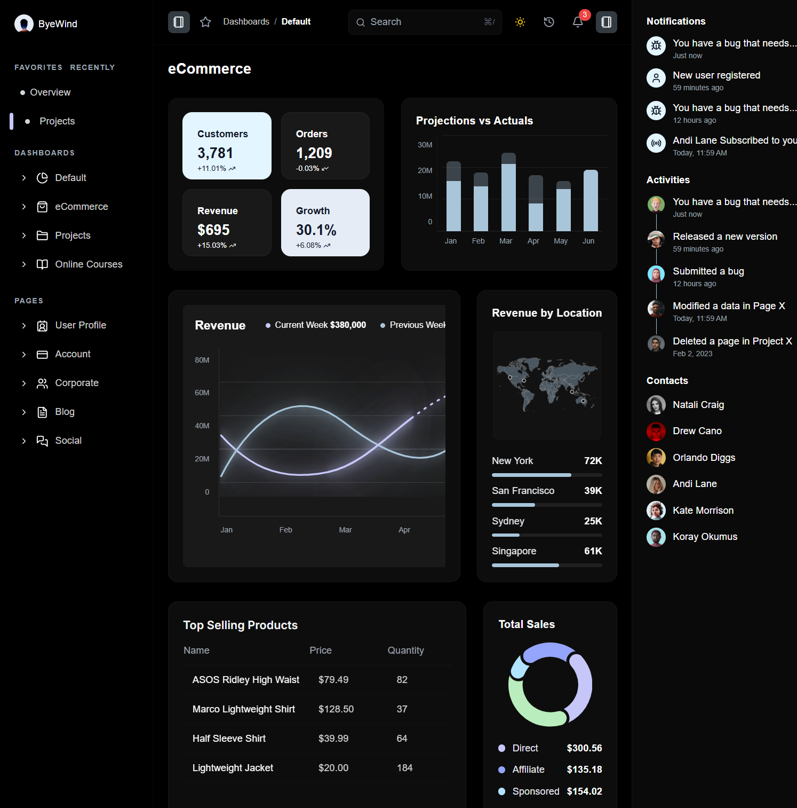

# 📊 Juspay Dashboard


> A modern, responsive dashboard application built with React and Tailwind CSS for visualizing and managing payment analytics, transaction data, and business metrics with real-time insights.

## 🌟 Live Demo

🚀 **[View Live Dashboard](https://juspay-dashboard-two.vercel.app/)**

## 📹 Video Walkthrough

▶ [Watch the Walkthrough Video](https://drive.google.com/file/d/1UT9Y_nZGzz885yimmXihhH9-Hqew_szd/view?usp=sharing)

 <!-- Add a screenshot of your dashboard here -->

## ✨ Key Features

### 🎯 **Core Functionality**
- **Interactive Dashboard** - Modern, clean interface with real-time data visualization
- **Order Management** - Comprehensive order tracking and management system  
- **Geographic Analytics** - World map integration with country-wise data visualization
- **Search Functionality** - Advanced search with real-time filtering capabilities
- **Responsive Design** - Seamless experience across desktop, tablet, and mobile devices
- **Theme Support** - Dark/Light mode with smooth transitions

### 🔧 **Technical Features**
- **Performance Optimized** - Fast loading with efficient data handling
- **Modern React Patterns** - Hooks, Context API, and functional components
- **Tailwind CSS** - Utility-first CSS framework for rapid UI development
- **Mock Data Integration** - Realistic sample data for development and testing
- **Toast Notifications** - User-friendly feedback system
- **Browser Compatibility** - Cross-browser support with polyfills

### 📱 **User Experience**
- **Intuitive Navigation** - Easy-to-use interface with clear information hierarchy
- **Real-time Updates** - Live data updates without page refreshes
- **Interactive Maps** - Geographic data visualization with world countries
- **Error Handling** - Graceful error boundaries and 404 pages
- **Accessibility** - WCAG compliant design patterns

## 🛠 Tech Stack

| Category | Technologies |
|----------|-------------|
| **Frontend** | React.js 18+, JavaScript ES6+ |
| **Styling** | Tailwind CSS, CSS3 |
| **State Management** | React Context API, Custom Hooks |
| **Data Visualization** | Custom charts, Geographic mapping |
| **Build Tools** | Create React App, Webpack |
| **Package Manager** | npm |
| **Version Control** | Git, GitHub |

## 🚀 Quick Start

### Prerequisites

Ensure you have the following installed:
- **Node.js** (version 16.x or higher) - [Download here](https://nodejs.org/)
- **npm** (version 8.x or higher) - Comes with Node.js

### Installation

1. **Clone the repository**
   ```bash
   git clone https://github.com/sahilbakshi3/Juspay-dashboard.git
   cd Juspay-dashboard
   ```

2. **Install dependencies**
   ```bash
   npm install
   ```

3. **Start the development server**
   ```bash
   npm start
   ```

4. **Open your browser**
   
   Navigate to [http://localhost:3000](http://localhost:3000) to view the application.

## 📁 Project Structure

```
Juspay-dashboard/
├── 📁 public/                          # Static public assets
│   ├── index.html                      # Main HTML template
│   ├── logo.png                        # Application logo
│   ├── manifest.json                   # PWA manifest file
│   └── robots.txt                      # Search engine crawling rules
│
├── 📁 src/                             # Source code directory
│   ├── 📁 assets/                      # Static assets and resources
│   │
│   ├── 📁 components/                  # Reusable UI components
│   │   └── [Component folders with JSX files]
│   │
│   ├── 📁 context/                     # React Context providers
│   │   ├── SearchContext.js            # Global search state management
│   │   ├── ThemeContextProvider.js     # Theme switching (dark/light mode)
│   │   └── ToastContext.js             # Toast notification system
│   │
│   ├── 📁 data/                        # Data management and mock data
│   │   ├── mapData.js                  # Geographic mapping data
│   │   ├── mockData.js                 # Sample dashboard data
│   │   └── world_countries.json        # World countries geographic data
│   │
│   ├── 📁 pages/                       # Page components (Route components)
│   │   ├── DashboardPage.js            # Main dashboard page
│   │   ├── OrdersPage.js               # Orders management page
│   │   └── PageNotFound.js             # 404 error page
│   │
│   ├── 📁 styles/                      # Styling files
│   │   └── index.css                   # Global styles and Tailwind imports
│   │
│   ├── 📁 utils/                       # Utility functions
│   │   ├── browserCompatibility.js     # Cross-browser compatibility utilities
│   │   └── toastUtils.js              # Toast notification helpers
│   │
│   ├── App.js                          # Main App component with routing
│   └── index.js                        # Application entry point
│
├── node_modules/                       # NPM dependencies (auto-generated)
├── .gitignore                          # Git ignore rules
├── package-lock.json                   # NPM lock file for consistent installs
├── package.json                        # NPM dependencies and scripts
├── README.md                           # Project documentation
└── tailwind.config.js                  # Tailwind CSS configuration
```

## 🎯 Core Components

### 📊 **Dashboard Features**
- **Real-time Metrics** - Key performance indicators and statistics
- **Interactive Charts** - Dynamic data visualizations with hover effects
- **Geographic Visualization** - World map with country-wise data representation
- **Recent Activity** - Latest transactions and system updates

### 🛒 **Order Management**
- **Order Tracking** - Comprehensive order status and history
- **Search & Filter** - Advanced filtering by status, date, customer, etc.
- **Order Details** - Detailed view of individual orders
- **Bulk Operations** - Multi-select actions for efficient management

### 🎨 **Theme System**
- **Dark/Light Mode** - Toggle between themes with smooth transitions
- **Persistent Preferences** - Theme selection saved across sessions
- **Consistent Styling** - Unified design language throughout the app

## 📋 Available Scripts

In the project directory, you can run:

### `npm start`
Runs the app in development mode.\
Open [http://localhost:3000](http://localhost:3000) to view it in the browser.\
The page will reload when you make changes, and you may see lint errors in the console.

### `npm test`
Launches the test runner in interactive watch mode.\
See the [running tests](https://facebook.github.io/create-react-app/docs/running-tests) documentation for more information.

### `npm run build`
Builds the app for production to the `build` folder.\
It correctly bundles React in production mode and optimizes the build for best performance.\
The build is minified and filenames include hashes for caching.

### `npm run eject`
**Note: This is a one-way operation. Once you `eject`, you can't go back!**

If you need full control over the build configuration, you can `eject` the project. This copies all configuration files and dependencies into your project.

## 🔧 Configuration

### Tailwind CSS Setup
The project uses Tailwind CSS for styling. Configuration can be found in:
- `tailwind.config.js` - Tailwind configuration and customizations
- `src/styles/index.css` - Global styles and Tailwind directives

### Environment Variables
Create a `.env` file in the root directory for environment-specific configurations:
```env
REACT_APP_API_BASE_URL=https://your-api-url.com
REACT_APP_APP_NAME=Juspay Dashboard
```

## 🌍 Data & Integration

### Mock Data
The application includes comprehensive mock data for development:
- **Dashboard Metrics** - Sample KPIs and statistics
- **Order Data** - Realistic order information with various statuses
- **Geographic Data** - World countries data for map visualizations
- **User Activity** - Sample user interactions and events

### API Integration Ready
The structure supports easy integration with real APIs:
- Centralized data management in `/src/data/`
- Context providers for state management
- Utility functions for data processing

## 🚀 Deployment

### Build for Production
```bash
npm run build
```

### Deployment Options

#### **Netlify**
1. Build the project: `npm run build`
2. Deploy the `build` folder to Netlify
3. Configure build settings if using continuous deployment

#### **Vercel**
1. Connect your GitHub repository to Vercel
2. Configure build settings:
   - Build Command: `npm run build`
   - Output Directory: `build`
3. Deploy automatically on push to main branch

#### **GitHub Pages**
1. Install gh-pages: `npm install --save-dev gh-pages`
2. Add deployment script to `package.json`:
   ```json
   "homepage": "https://sahilbakshi3.github.io/Juspay-dashboard",
   "scripts": {
     "predeploy": "npm run build",
     "deploy": "gh-pages -d build"
   }
   ```
3. Run: `npm run deploy`

## 🔍 Features Walkthrough

### 🏠 **Dashboard Page**
- **Overview Cards** - Key metrics at a glance
- **Interactive Charts** - Revenue, growth, and performance trends
- **World Map** - Geographic distribution of data
- **Recent Activity** - Latest system updates and transactions

### 📦 **Orders Page**
- **Order List** - Comprehensive table with sorting and filtering
- **Search Functionality** - Real-time search across all order fields
- **Status Management** - Visual status indicators and bulk updates
- **Pagination** - Efficient handling of large datasets

### 🎨 **Theme System**
- **Seamless Switching** - Instant theme changes without page reload
- **System Preference** - Automatic detection of user's system theme
- **Consistent Experience** - All components adapt to theme changes

## 🤝 Contributing

We welcome contributions! Please follow these steps:

1. **Fork the repository**
2. **Create a feature branch**
   ```bash
   git checkout -b feature/AmazingFeature
   ```
3. **Commit your changes**
   ```bash
   git commit -m 'Add some AmazingFeature'
   ```
4. **Push to the branch**
   ```bash
   git push origin feature/AmazingFeature
   ```
5. **Open a Pull Request**

### 📋 Contribution Guidelines
- Follow the existing code style and patterns
- Add comments for complex logic
- Update documentation for new features
- Test your changes thoroughly
- Keep commits focused and descriptive

## 🐛 Issues and Support

If you encounter any issues or have suggestions:

1. **Check existing issues** - Your question might already be answered
2. **Create a new issue** - Use our issue templates for bug reports or feature requests
3. **Provide details** - Include screenshots, error messages, and steps to reproduce

📧 **Contact:** [Open an issue](https://github.com/sahilbakshi3/Juspay-dashboard/issues) on GitHub

## 📄 License

This project is licensed under the MIT License - see the [LICENSE](LICENSE) file for details.

## 👨‍💻 Author

**Sahil Bakshi**
- GitHub: [@sahilbakshi3](https://github.com/sahilbakshi3)
- LinkedIn: [Connect with me](https://linkedin.com/in/sahilbakshi3) *(Add your actual LinkedIn profile)*

## 🙏 Acknowledgments

- **React Community** - For excellent documentation and ecosystem
- **Tailwind CSS** - For the amazing utility-first CSS framework
- **Create React App** - For providing the initial project structure
- **Open Source Community** - For inspiration and best practices

## 📈 Future Enhancements

- [ ] **Real API Integration** - Connect with actual payment gateway APIs
- [ ] **Advanced Analytics** - More detailed charts and reporting features
- [ ] **User Authentication** - Login/logout functionality with role-based access
- [ ] **Export Features** - PDF and Excel export for reports
- [ ] **Real-time Notifications** - WebSocket integration for live updates
- [ ] **Mobile App** - React Native version for mobile platforms
- [ ] **Advanced Filtering** - More granular filtering options
- [ ] **Dashboard Customization** - User-configurable dashboard widgets

---

⭐ **If you found this project helpful, please give it a star on GitHub!**

*Last updated: September 2025*